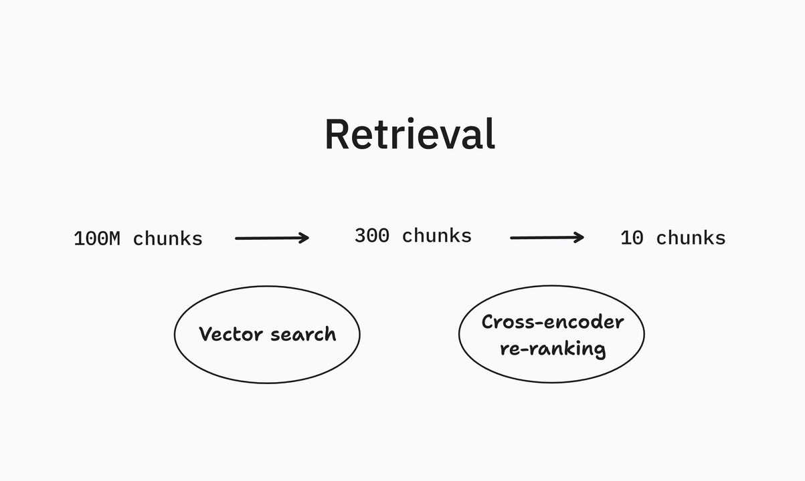

[Published LinkedIn article](https://www.linkedin.com/pulse/cross-encoder-vector-search-re-ranking-viktor-qvarfordt-fnmzf/?trackingId=hdrZDO%2BDRempRP9Hy2PY1A%3D%3D)



# Cross-encoder for vector search re-ranking

In RAG applications, cross-encoders are used for re-ranking vector search. _How?_

First, one uses vector search to get the top few hundred most relevant chunks. Then, the chunks are re-ranked with a cross-encoder. _Why two steps?_

Cross-encoders give high quality ranking but are slow. Vector search gives ok ranking but is fast. It is fast because vector similarity can be computed using an index. Think of this in the same way as an SQL database creates an index for efficient lookup. _Why not index the cross-encoder?_

A cross encoder takes two strings as input and gives a relevance score as output. An index cannot be created from this. _Ok, but how to use it?_

Run the cross encoder on your query against all chunks. Then sort by the score. If you have few chunks and need high quality ranking, you might not need vector search at all, just cross-encoding.

## Cross-encoder example code

Example code for running a cross-encoder to score your chunks. Here is a dev server using a pre-trained cross-encoder from Hugging Face, https://huggingface.co/cross-encoder/ms-marco-MiniLM-L-12-v2: 

```py
# file: server.py

from flask import Flask, request, jsonify
from sentence_transformers import CrossEncoder

model = CrossEncoder('cross-encoder/ms-marco-MiniLM-L-12-v2', max_length=512)

app = Flask(__name__)


@app.route("/score", methods=['POST'])
def score():
    query = request.json['query']
    chunks = request.json['chunks']

    scores = model.predict([(query, chunk) for chunk in chunks]).tolist()

    index_with_score = sorted(enumerate(scores), key=lambda x: x[1], reverse=True)

    return jsonify(index_with_score)


app.run(port=8000)
```

Start the server:

```sh
$ python server.py
```

Use it to rank a query against chunks:

```sh
curl http://localhost:8000/score \
  -H 'content-type: application/json' \
  -d '{
    "query": "Who was the first person to walk on the moon?",
    "chunks": [
      "The moon landing was watched by millions of people around the world on television. This historical event marked the success of the Apollo program and was a significant victory in the space race during the Cold War.",
      "Apollo 11 was the first manned mission to land on the moon. The spacecraft carried three astronauts: Neil Armstrong, Buzz Aldrin, and Michael Collins. Neil Armstrong and Buzz Aldrin both walked on the moon’s surface, whereas Michael Collins orbited above.",
      "Space exploration has evolved significantly since the early missions. Today, organizations not only from the United States and Russia but also from Europe, China, and India are actively participating in exploring outer space, with goals to land on the moon and Mars."
    ]
  }'
```

Outputs:

```
[
  [1, 8.101385116577148],
  [0, -5.674482345581055],
  [2, -8.991270065307617]
]
```

This is correct since the answer to the query is found only in the second chunk.
